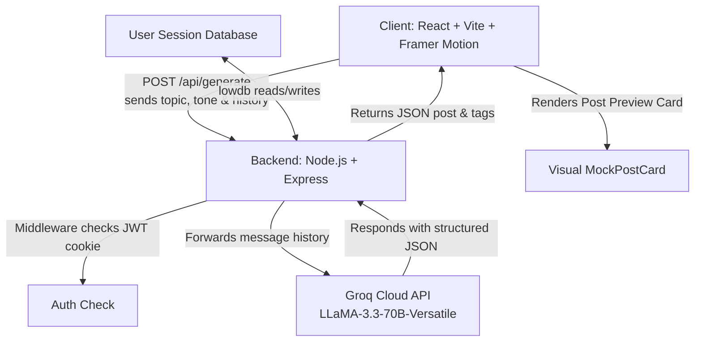

# LinkedAgent 🚀
> An AI-powered LinkedIn draft builder and real-time visual mockup preview engine. 

LinkedAgent allows users to turn raw, 1-to-2 line thoughts into polished, structured, hook-driven LinkedIn posts. It runs on a modern React frontend and a Node.js/Express backend, fetching model responses instantly using Groq's high-speed LLaMA-3.3-70B API.

---

## 🏗️ System Architecture

The application is built on a client-server model designed for maximum privacy, speed, and clean code division:



### Tech Stack Details:
- **Frontend**: React 19, Vite, Framer Motion (for smooth layout and page entry transitions), Lucide React (icons), and custom responsive CSS.
- **Backend**: Node.js, Express, JSON Web Token (JWT) cookies, Cookie Parser, Bcrypt.js (password hashing).
- **Database**: LowDB (a local JSON file-based database for zero-config credential storage).
- **LLM Engine**: Groq Cloud API querying `llama-3.3-70b-versatile` (leveraging strict JSON mode formatting).

---

## 💡 How It Works: Under the Hood

### Step 1: User Input
The user inputs a simple sentence (e.g., *"Shipped my first React app today after hours of debugging"*) and selects a writing tone/angle (e.g., `Technical insight` or `Personal story`).

### Step 2: Client Prompt Formatting
When the user clicks "Start", the client maps the selected tone to predefined guidelines. For example:
- **Tone**: `Technical insight` maps to the prompt: `Angle: Technical insight (Share something you built or debugged).\nWhat happened / what to post about: Shipped my first React app today after hours of debugging`.
- This string is wrapped in a message object: `{ role: "user", content: "..." }` and initialized into the `history` state array.

### Step 3: Secure Transmission
The client makes a `POST` request to the backend `/api/generate` endpoint, carrying the `history` array in the request body. Because the client request passes `credentials: "include"`, the browser automatically forwards the secure, HTTP-only JWT session cookie to authenticate the request on the server.

### Step 4: Strict JSON Prompting on the Server
The Express server receives the request, authorizes the session, and sets up a call to Groq. 
The backend enforces a strict **System Prompt** defining the structure, layout rules, and response constraint:
```javascript
const SYSTEM_PROMPT = `You write LinkedIn posts for the user based on the topic and angle they provide.

Rules for every post:
- Hook-driven opening line (no "I'm excited to announce")
- Short paragraphs, max 2 sentences each, generous whitespace
- Use **word** for bold emphasis on key phrases (2-4 per post, not more)
- End with one clear call to action
- 3-5 relevant hashtags, placed on their own line at the end
- No corporate jargon ("synergy", "paradigm shift", "leverage")
- Sound like a real person, not a marketing bot

Respond with ONLY raw JSON, no markdown fences, no preamble:
{"post": "full post text with \\n for line breaks", "hashtags": ["#Tag1","#Tag2"]}`;
```

To guarantee that the model behaves exactly as required, the backend passes `response_format: { type: "json_object" }` to Groq. This forces the model's output decoder to only emit valid JSON matching the system rules.

### Step 5: Backend Parsing & Output Verification
The Groq model processes the instructions, structures the raw text with appropriate line breaks (`\n`), selects hashtags, and returns the JSON payload.
The backend cleans the response string of any accidental markdown code-fences and parses the JSON:
```json
{
  "post": "Shipped something today that I almost gave up on twice.\n\nThe bug wasn't in my code — it was in my **assumption** about how the API responded.\n\nLesson: when the docs and the behavior disagree, trust the behavior.",
  "hashtags": ["#buildinpublic", "#webdev", "#reactjs"]
}
```
If parsing succeeds, it returns this structured object back to the client.

### Step 6: Visual Rendering and Live Mockup
The client receives the JSON object and updates the page state. 
The `MockPostCard` component takes this state and renders it in real-time inside a styled card modeled exactly after a LinkedIn feed post (featuring visual headers, profile icons, and action tabs like Like, Comment, Repost).

### Step 7: Conversational Iteration (Multi-Turn Chat)
If the user wants changes (e.g. *"Make it shorter"*), they type it into the refinement box. 
The client appends this request: `{ role: "user", content: "Revise the draft with this feedback: Make it shorter" }` to the message history and resubmits it.
Because the full conversation log is sent to Groq, the model understands the context of the previous draft and modifies it accordingly.

---

## 🛠️ How to Build This From Scratch

### 1. Initialize Project & Directories
Create your workspace and initialize your frontend and backend environments:
```bash
mkdir linkedin-agent-project && cd linkedin-agent-project
mkdir server client
```

### 2. Backend Setup (`server/`)
1. Run `npm init -y` inside `server/`.
2. Install dependencies:
   ```bash
   npm install express cors dotenv cookie-parser bcryptjs jsonwebtoken lowdb
   ```
3. Create your local file database file `db.js` using `lowdb` to read/write from a local `db.json` file.
4. Set up an authentication middleware (`auth.js`) that reads cookies, extracts JWTs, verifies them using `jsonwebtoken`, and blocks unauthorized requests.
5. Create `server.js` to define endpoints:
   - `/api/auth/signup`, `/api/auth/login`, `/api/auth/logout`, `/api/auth/me` (handles bcrypt parsing and secure cookies).
   - `/api/generate` (handles POST requests forwarding to Groq with the system prompt guidelines).
6. Create a `.env` file specifying port, client URL, JWT secret key, and your Groq API key:
   ```env
   PORT=3001
   CLIENT_URL=http://localhost:5173
   JWT_SECRET=supersecretlongstring
   GROQ_API_KEY=gsk_your_groq_api_key
   ```

### 3. Frontend Setup (`client/`)
1. Create a Vite React app:
   ```bash
   npm create vite@latest . -- --template react
   npm install react-router-dom lucide-react framer-motion
   ```
2. Set up `src/context/AuthContext.jsx` to wrap your React application tree and handle login, sign-up, session state recovery on startup (`/api/auth/me`), and logouts.
3. Configure `App.jsx` with routes:
   - `/`: `Landing.jsx` (features scroll animations and visual previews).
   - `/login` & `/signup`: Auth screens.
   - `/about`: Dynamic values page.
   - `/services`: Capability cards using Framer Motion exit/entry animations.
   - `/dashboard`: Protected route wrapping `LinkedAgent.jsx` (which contains prompt selectors, prompt history, and the Live LinkedIn Preview).
4. Run `npm run dev` in the client and `node server.js` in the server.

---

## 🗣️ Interview Q&A Preparation

### Q1: How does a user prompt translate into a post?
> **Answer**: The application splits the workload. The client wraps the user prompt with tone instructions and forwards it as a history array. The backend acts as a proxy, appending a strict system prompt (defining hook rules, formatting, and bold keywords) and requesting JSON Mode from Groq. Groq streams back structured JSON, which the frontend renders live inside our custom CSS-styled card mockup.

### Q2: Why did you use JSON mode instead of raw text parsing?
> **Answer**: Parsing raw text reliably is extremely difficult when you need to split hashtags, separate drafts, and format line breaks cleanly. Using Groq's JSON mode ensures that the model outputs structured keys (`post` and `hashtags`) with standard string escapes (`\n`), allowing the application to safely run `JSON.parse` and render fields directly in UI components.

### Q3: How is authentication secured?
> **Answer**: Authentication uses JSON Web Tokens (JWT) stored in HTTP-Only cookies. By storing tokens in cookies with `httpOnly: true`, the token is inaccessible to client-side scripts, protecting it from Cross-Site Scripting (XSS) attacks. Credentials are submitted securely over backend checks, and CORS configuration ensures only our specific client domain can make API calls.

### Q4: Why did you choose LowDB for the database?
> **Answer**: LowDB is a lightweight local database that reads and writes directly to a local JSON file. It was selected because it has zero dependency overhead and avoids complex server configuration (like Dockerizing database setups), making it perfect for rapid prototyping. If the project expands, the interface database functions (`findUserByEmail`, `createUser`) can easily be rewritten to call MongoDB, MySQL, or PostgreSQL.
